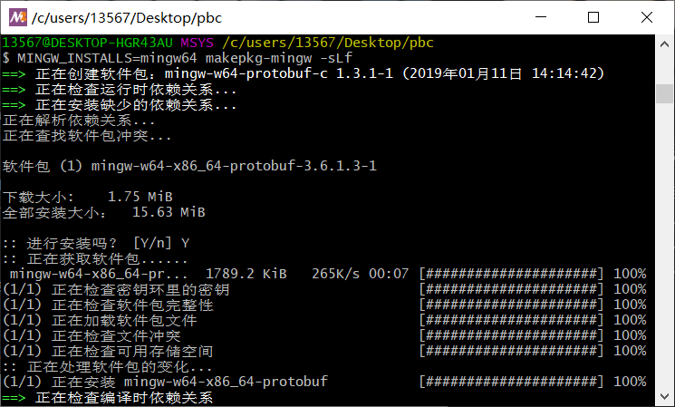

# protobuf-c-win
Protobuf-c Win-platform binaries, built with MSYS2, test on STM32F446 (IDE: Keil5).

Using https://github.com/protobuf-c/protobuf-c.

## How to use gen.exe?

1. Open a terminal.
2. Type `gen --help`.
3. OK! Now you know HOW.

## How to compile with Keil5?

1. Add **protobuf-c** folder to your project.
2. Generate your files use **gen.exe**, then add them to your project.
3. Write your program, according to files in **test** folder.
4. **DO NOT USE** **MicroLib**.

## How to compile protoc.exe?

1. Install [MSYS2](http://www.msys2.org/).

2. New a folder, for example, pbc.

3. Enter pbc, new a file named "PKGBUILD".

4. Fill the file with the code below.

   ```
   # Maintainer: Alexey Pavlov <alexpux@gmail.com>
   
   _realname=protobuf-c
   pkgbase=mingw-w64-${_realname}
   pkgname="${MINGW_PACKAGE_PREFIX}-${_realname}"
   pkgver=1.3.1
   pkgrel=1
   pkgdesc="Protocol Buffers implementation in C (mingw-w64)"
   arch=('any')
   url="https://github.com/protobuf-c/protobuf-c"
   license=('BSD')
   depends=("${MINGW_PACKAGE_PREFIX}-protobuf")
   makedepends=("${MINGW_PACKAGE_PREFIX}-gcc")
   options=('staticlibs' 'strip')
   source=("$url/releases/download/v${pkgver}/${_realname}-${pkgver}.tar.gz")
   sha256sums=('51472d3a191d6d7b425e32b612e477c06f73fe23e07f6a6a839b11808e9d2267')
   
   prepare() {
     cd "${srcdir}/${_realname}-${pkgver}"
     autoreconf -fiv
   }
   
   build() {
     [[ -d "${srcdir}/build-${MINGW_CHOST}" ]] && rm -rf "${srcdir}/build-${MINGW_CHOST}"
     mkdir -p "${srcdir}/build-${MINGW_CHOST}" && cd "${srcdir}/build-${MINGW_CHOST}"
   
     ../${_realname}-${pkgver}/configure \
         --prefix=${MINGW_PREFIX} \
         --build=${MINGW_CHOST} \
         --host=${MINGW_CHOST}
     make
   }
   
   check() {
     cd "${srcdir}/build-${MINGW_CHOST}"
     make check || true
   }
   
   package() {
     cd "${srcdir}/build-${MINGW_CHOST}"
     make DESTDIR="${pkgdir}" install
     install -Dm644 ${srcdir}/${_realname}-${pkgver}/LICENSE "${pkgdir}${MINGW_PREFIX}"/share/licenses/${_realname}/LICENSE
   }
   ```

5. Open a terminal in this folder, type `MINGW_INSTALLS=mingw64 makepkg-mingw -sLf`.

   

6. Wait for compiling done.

   

7. Install the lib you have just compiled.

   type `pacman -U mingw-w64-x86_64-protobuf-c*.pkg.tar.xz`, enter.

   

8. Copy **EXE  & DLL files** from `MSYS2 path` to your folder.

9. Do what you want.

   